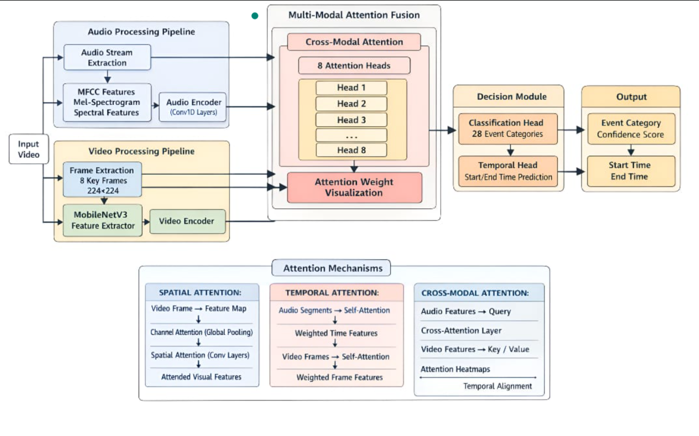
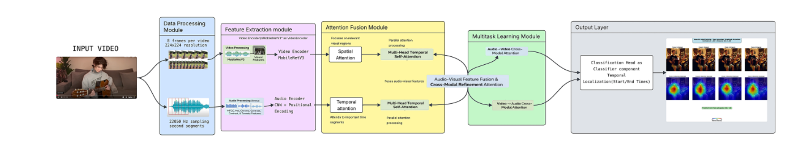

# Audio-Visual Event Localization using Attention Mechanisms

This repository presents an **end-to-end deep learning framework for Audio-Visual Event Localization (AVEL)**.  
The model jointly processes **audio signals and video frames** using **spatial, temporal, and cross-modal attention mechanisms** to:

- **Classify audio-visual events**
- **Localize events temporally (start & end times)**
- **Visualize attention across audio, video, and their interactions**

This project is designed for **research, academic, and educational purposes** and follows modern multi-modal learning principles.

---

## ✨ Key Features

- ✅ Audio feature extraction using MFCC, Mel Spectrogram, Chroma & Spectral Contrast
- ✅ Video feature extraction using **MobileNetV3**
- ✅ **Spatial Attention** over video frames
- ✅ **Temporal Attention** for audio and video streams
- ✅ **Cross-Modal Attention** for audio–visual alignment
- ✅ Multi-head attention-based fusion
- ✅ Multi-task learning:
  - Event Classification (28 classes)
  - Temporal Localization (start & end time)
- ✅ Attention visualization for interpretability
- ✅ Early stopping & learning rate scheduling

---

## 🧠 Architecture Overview

The following diagrams illustrate the complete **Audio-Visual Event Localization pipeline**, including feature extraction, attention-based fusion, and output prediction.

### Overall Audio-Visual Architecture


### Multi-Modal Attention Fusion


### Detailed Processing Pipeline


> The architecture integrates spatial, temporal, and cross-modal attention mechanisms to achieve robust and interpretable audio-visual event localization.

---

## 🧩 Model Architecture (Conceptual)

### 1. Audio Processing Pipeline
- Audio extraction from video
- Feature computation:
  - MFCC
  - Mel Spectrogram
  - Chroma
  - Spectral Contrast
  - Tonnetz
- 1D CNN-based Audio Encoder
- Temporal Self-Attention

### 2. Video Processing Pipeline
- Frame extraction (8 key frames per video)
- Image resizing (224 × 224)
- Feature extraction using **MobileNetV3**
- Spatial Attention
- Temporal Self-Attention

### 3. Audio-Visual Fusion
- Self-attention within each modality
- Cross-modal attention (Audio ↔ Video)
- Multi-head attention (8 heads)

### 4. Output Heads
- **Classification Head** → Event Category (28 classes)
- **Temporal Regression Head** → Start & End Time

---

## 📂 Dataset Structure

Expected directory structure:

```text
AVE_Processed/
├── audio_wav/
│   ├── video_001.wav
│   ├── video_002.wav
│   └── ...
├── video_frames/
│   ├── video_001/
│   │   ├── frame_001.jpg
│   │   ├── frame_002.jpg
│   │   └── ...
│   └── ...
├── Finalave/
│   └── attention_visualization/
```
## 📝 Annotations File

File: Annotations.txt
Format:
Category & VideoID & Quality & StartTime & EndTime

## ⚙️ Configuration

All hyperparameters are controlled through a central Config class:
class Config:
    num_classes = 28
    batch_size = 4
    learning_rate = 1e-4
    epochs = 30
    num_frames = 8
    audio_feat_dim = 256
    video_feat_dim = 256
Modify this class to experiment with different settings.

## 💯 Training the Model

To train the model, run:
python ave.py

Training Features

✔ Automatic best-model saving
✔ Early stopping to prevent overfitting
✔ Learning rate scheduler
✔ Loss curve visualization

Saved model:
best_model_with_attention.pth

## 📊 Loss Functions

Classification Loss: Cross Entropy Loss
Temporal Localization Loss: L1 Loss

Final Loss:
Total Loss = Classification Loss + 0.3 × Temporal Loss

## 🔍 Attention Visualization

The model generates attention visualizations to improve interpretability:

Spatial attention heatmaps on video frames
Temporal attention plots for audio & video
Cross-modal attention alignment maps
Training loss curves

Saved at:
Finalave/attention_visualization/

## 🛠 Dependencies

Install required libraries using:
pip install torch torchvision librosa opencv-python numpy pandas matplotlib seaborn scikit-learn pillow

## 💻 Hardware Support

✔ CUDA-enabled GPU support
✔ CPU fallback available
✔ Headless server compatible (Matplotlib Agg backend)
